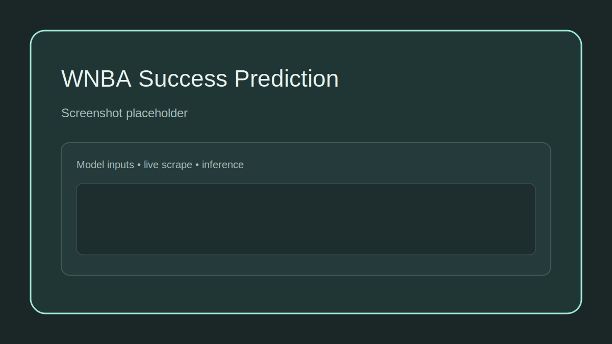
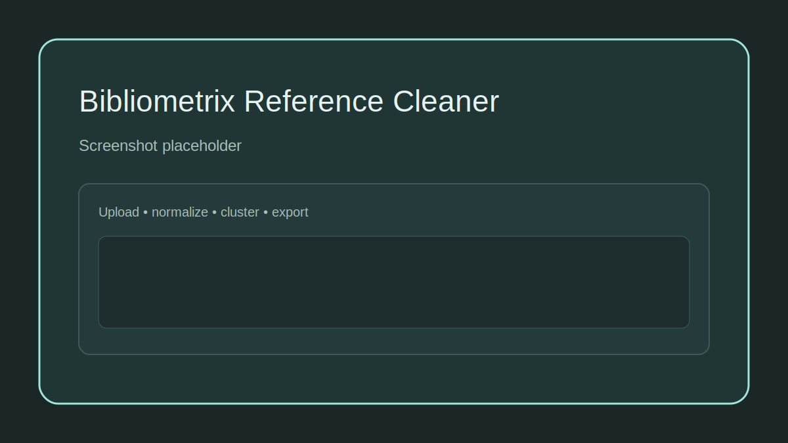
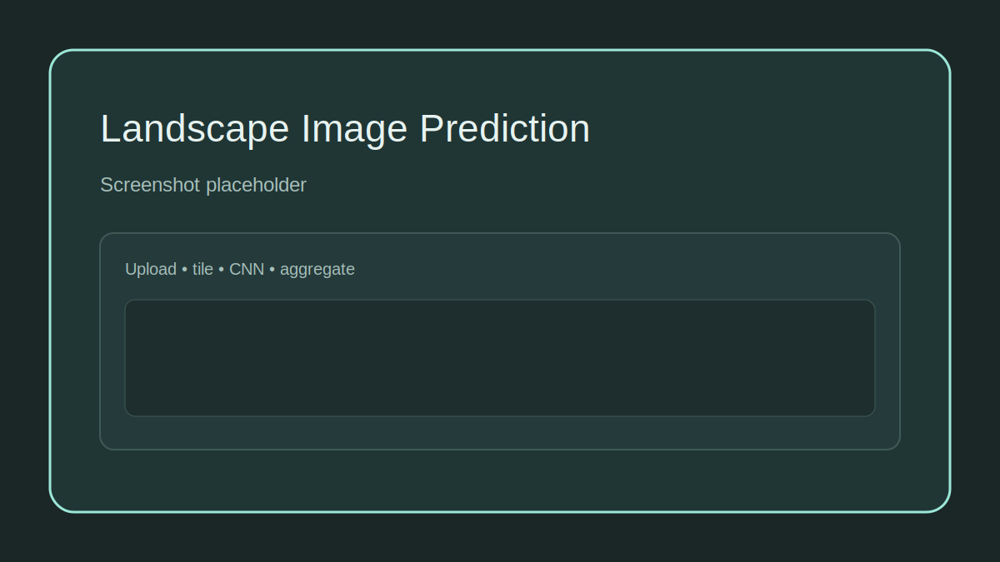

# DataEngBuilds - Data Engineering Portfolio

DataEngBuilds is my personal portfolio site and repo for end-to-end data engineering work: ingestion, normalization, ML inference, and lightweight analytics. The Streamlit app is the front door, while each project lives in `projects/` with its own code, artifacts, and README.

## Quickstart

**Local (Poetry)**
1. `poetry install`
2. `poetry run streamlit run app.py`

**Docker**
1. `docker build -t dataengbuilds .`
2. `docker run -p 8501:8501 --env-file .env dataengbuilds`

Open `http://localhost:8501`.

## Flagship Projects
**WNBA Success Prediction**  
`pages/2_wnba_success.py` + `projects/wnba_success/README.md`  
  
Architecture diagram: `projects/wnba_success/README.md`  
Offline mode: `projects/wnba_success/README.md`

**Bibliometrix Reference Cleaner**  
`pages/8_bibliometrix_reference_cleaner.py` + `projects/bibclean/README.md`  
  
Architecture diagram: `projects/bibclean/README.md`

**Landscape Image Prediction**  
`pages/1_landscape_img.py` + `projects/landscape_img/README.md`  
  
Architecture diagram: `projects/landscape_img/README.md`

## Labs (WIP)
- Random Ellipses - `pages/5_ellipses.py` + `projects/ellipses/README.md`
- Game of Life - `pages/4_game_of_life.py` + `projects/game_of_life/README.md`
- Happy Prime - `pages/6_happy_prime.py` + `projects/happy_prime/README.md`

## Architecture (High Level)
```text
User
  -> Streamlit UI (app.py -> pages/*)
      -> Project code (projects/*)
          -> Models and assets (projects/**/model, projects/**/assets)
          -> Data sources
              - sports-reference.com (WNBA live scrape)
              - Scopus / Web of Science uploads (Bibliometrix)
              - User uploads (Landscape)
          -> Optional storage (DigitalOcean Spaces for analytics)
```

## Repo Map
- `app.py` - Streamlit entrypoint
- `app/` - shell config, layout helpers, shared UI
- `pages/` - multipage Streamlit entry points
- `projects/` - project code and artifacts
- `shared/` - cross-project utilities (cloud functions, helpers)
- `static/` - site assets (logos, resume)
- `docs/` - portfolio narrative and architecture notes

## Configuration and Secrets
- Use `.env.example` as a template for local secrets.
- Streamlit can also read `.streamlit/secrets.toml`.

## Tests and CI
- Tests: `poetry run pytest projects/bibclean/tests`
- Import checks: `python -m compileall app pages projects shared`

CI runs import checks and project tests on push/PR.
