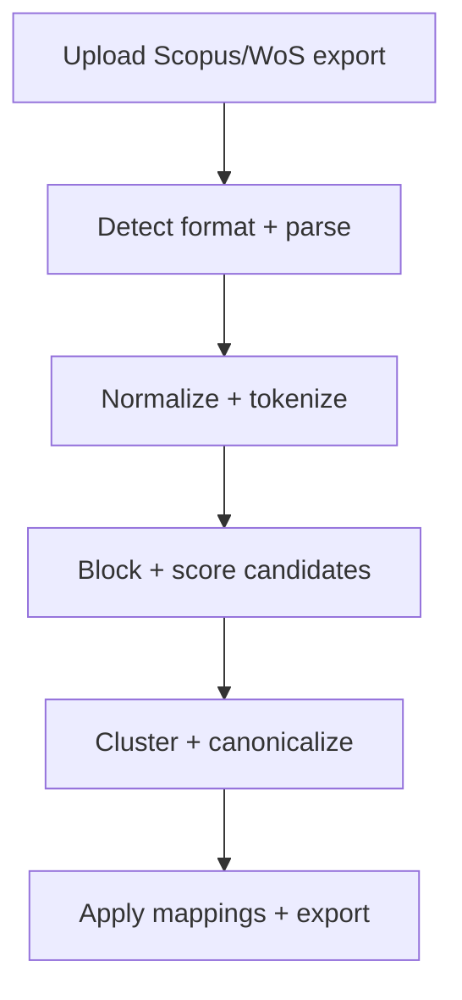

# Bibliometrix Reference Cleaner (bibclean)

## Problem
Canonicalize cited references from Scopus or Web of Science so they import cleanly into bibliometrix/Biblioshiny.

## Screenshot

## Architecture

## Data Sources
- Scopus CSV exports
- Web of Science plaintext exports
- Sample fixtures in `projects/bibclean/fixtures/`

## Pipeline
1. Detect input format and parse raw records.
2. Normalize and tokenize references (author names, years, DOIs).
3. Block and score candidates using fuzzy matching.
4. Cluster duplicates and choose canonical references.
5. Apply mappings back to the original export format.

## Key Tradeoffs
- Thresholds control precision vs recall in the merge step.
- In-memory processing favors interactive use over very large datasets.
- Deterministic normalization keeps outputs stable across runs.

## How To Run
- Streamlit page: `poetry run streamlit run pages/8_bibliometrix_reference_cleaner.py`
- CLI (optional): `python -m projects.bibclean.cli --help`
- Tests: `poetry run pytest projects/bibclean/tests`

## Structure
- `apply/` - apply canonical mappings to raw exports
- `io/` - parsers and writers for Scopus/WoS
- `match/` - blocking, scoring, clustering logic
- `normalize/` - parsing and normalization helpers
- `fixtures/` - sample inputs and demo outputs
- `tests/` - pytest coverage for core flows
