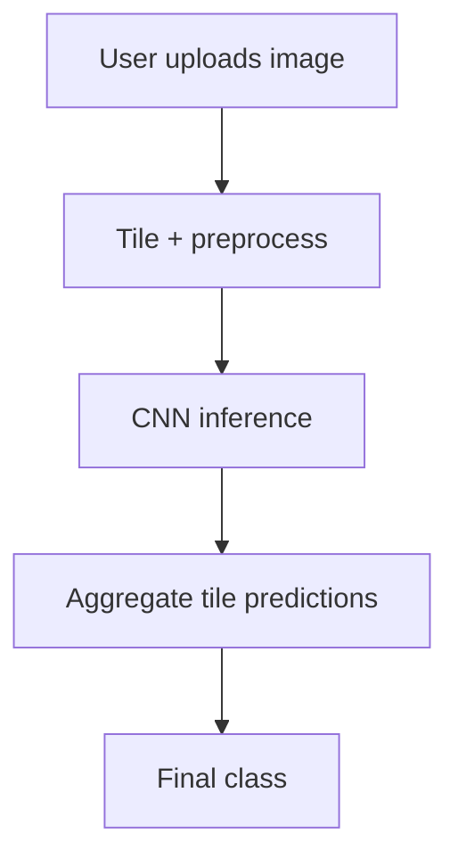

# Landscape Image Prediction

## Problem
Classify a landscape photo into one of several scene types (buildings, forest, glacier, mountain, sea, street).

## Screenshot

## Architecture

## Data Sources
- User-uploaded images
- Pretrained CNN model in `projects/landscape_img/model/`

## Pipeline
1. User uploads an image in the Streamlit UI.
2. The image is tiled into overlapping 150x150 patches.
3. Tiles are preprocessed and sent through a CNN model.
4. Tile predictions are averaged to produce a final class.

## Key Tradeoffs
- The model is inference-only; training data is not shipped in this repo.
- Tiling improves robustness but adds compute cost on large images.

## How To Run
- Streamlit app: `poetry run streamlit run app.py` and open the Landscape Image card.
- Direct page: `poetry run streamlit run pages/1_landscape_img.py`
