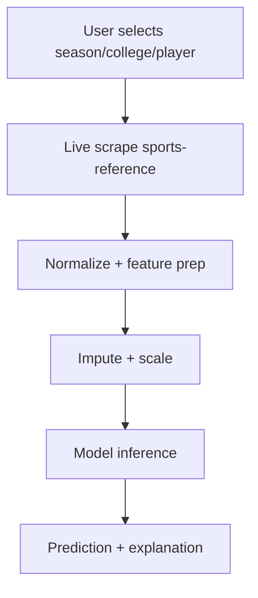

# WNBA Success Prediction

## Problem
Estimate the likelihood of WNBA success for college players using publicly available NCAA statistics.

## Screenshot

## Architecture

## Data Sources
- Live HTML scrape from `sports-reference.com` (team and season stats)
- Local model artifacts in `projects/wnba_success/model/`

## Pipeline
1. User selects season, college, and player in the Streamlit UI.
2. The app scrapes season and team stats and normalizes school names.
3. Features are assembled, missing values are imputed, and features are scaled.
4. A cached model produces a prediction and key feature context.

## Key Tradeoffs
- Uses live scraping for freshness, which can introduce latency or upstream rate limits.
- The model is pre-trained and shipped as a cached artifact to keep inference fast.
- Feature coverage is limited to what is available on sports-reference.

## How To Run
- Streamlit app: `poetry run streamlit run app.py` and open the WNBA Success card.
- Direct page: `poetry run streamlit run pages/2_wnba_success.py`

## Offline Mode
If network access is unavailable, the app falls back to fixtures in `projects/wnba_success/fixtures/offline_catalog.json`.

**Force offline mode**
- `WNBA_OFFLINE=1 poetry run streamlit run app.py`
